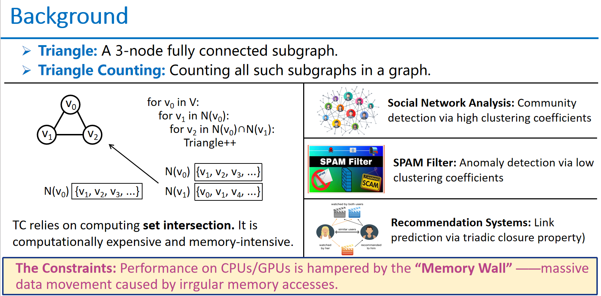
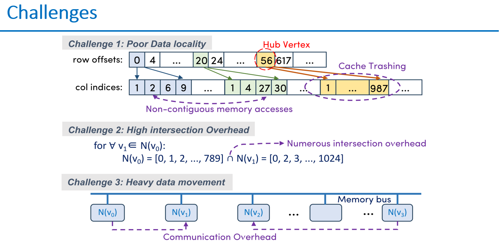
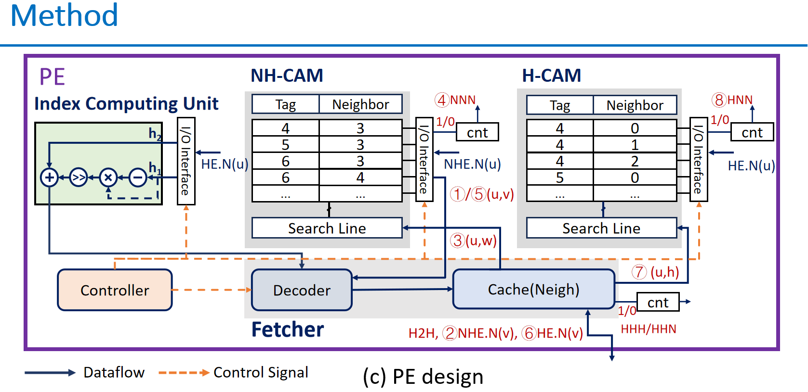
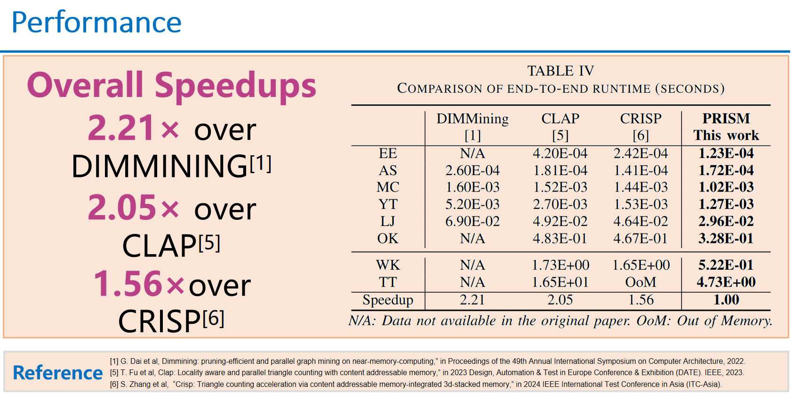

# PRISM-Scalable Triangle Counting 

This is the official software implementation of the paper, PRISM: A Locality-Aware Near-Memory Processing Framework for Scalable Triangle Counting

## Overview







## Code Structure

*   **`HetPE_simulator`**: Contains a simulator of our hybrid CAM/Bitmap-based triangle counting architecture. It implements the locality-aware TC algorithm and the specialized engines (Index Computing Unit, NH-CAM, H-CAM). The simulator performs the triangle counting task on a given target graph and generates the memory trace.
*   **`cache_sim`**: Contains the cache simulator we used to emulate the behavior of the on-chip cache. It takes the memory trace generated by `HetPE_simulator` and outputs the DRAM request trace.
*   **`ramulator`**: A fast and extensible DRAM simulator used to model the memory system latency and bandwidth, taking the output from `cache_sim`.
*   **`cacti`**: An analytical tool for modeling the access time, cycle time, area, and power of caches and memories.
*   **`data`**: Directory for storing input graph datasets and intermediate files.
*   **`setup.sh`**: Helper script to initialize and build the project.
*   **`run_PRISM.sh`**: Script to run experiments with different Hub node percentages.

## Requirements

*   GCC/Clang with C++17 support (or higher)
*   CMake >= 3.10
*   Make
*   Python 3.x (for preprocessing scripts)

## Setup

### Environment Setup

We recommend using a standard Linux environment with the required build tools.

```bash
# Clone this repository
git clone https://github.com/your-username/PRISM.git
cd PRISM

# Ensure dependencies are met
# (Install CMake and C++ compiler if not present)
```

### Build the Simulator

You can build the entire project using the provided setup script:

```bash
./setup.sh
```

Alternatively, build the components manually:

**1. Build the PRISM HetPE Simulator:**

```bash
cd HetPE_simulator
mkdir -p build && cd build
cmake ..
make
```

**2. Build the Cache Simulator:**

```bash
cd cache_sim
mkdir -p build && cd build
cmake ..
make
```

**3. Build Ramulator (Optional for full memory simulation):**

```bash
cd ramulator
make
```

## Usage

### 1. Data Preparation & Preprocessing

First, you need to preprocess the raw graph data. PRISM requires input graphs to be in a specific binary CSR format with **degree-based orientation**.

The `preprocess` tool (built in `CAM_simulator/build`) takes a raw edge list, relabels nodes by degree (Hubs get smaller IDs), directs edges from low-ID to high-ID to form a DAG, and outputs the binary files.

```bash
# Example: converting 'astro' dataset
cd HetPE_simulator/build
./preprocess astro
```
*Input:* `data/edge_list/random/astro.txt`  
*Output:* `data/CSR/astro.bin`

### 2. Run the PRISM Simulator

Run the simulator to perform triangle counting and generate memory traces. You can specify the Hub percentage (default 1%).

```bash
# Return to root directory
cd ../..

# Run the experiment script (adjusts HUB_PERCENTAGE and graphs in the script)
export HUB_PERCENTAGE=0.01
./run_PRISM.sh
```

This script will execute `HetPE_simulator/build/triangle_counting` which:
1.  Loads the preprocessed graph.
2.  Partitions it into Hub-to-Hub (H2H) and non-hub regions (HE/NHE).
3.  Simulates the hardware execution.
4.  Outputs execution logs and memory traces to `output/`.

### 3. Run Cache Simulation

After generating the trace from the simulator, run the cache simulator to get DRAM access latency/traffic.

```bash
# Example command (adjust paths as necessary)
# ./cache_sim/build/CacheSim <cache_size> <block_size> <assoc> <...other params> <input_trace> <output_dram_trace>

./cache_sim/build/CacheSim 8 64 2 4 2 1 output/trace/astro/astro.trace output/trace/astro_cache/astro_dram.trace
```

## Data Format

### Preprocessing Input (Edge List)
The input to the preprocessor is a simple edge list text file.
*   Lines starting with `#` or `%` are comments.
*   Each line contains two integers `u v` representing an edge between node `u` and `v`.
*   Self-loops (`u == v`) are ignored.

### Specialized Internal Formats (Connectivity-Aware Storage)
PRISM uses a specialized **Connectivity-Aware Storage (CAS)** format internally, derived from the standard CSR after degree sorting:

1.  **H2H Bitmap**: A dense triangular bitmap storing connections between the top `K%` (Hub) nodes.
    *   Allows O(1) **Hub-Pair Checking**.
2.  **Hub-Edges (HE) CSR**: Stores neighbors of a node that are **Hubs**.
3.  **Non-Hub-Edges (NHE) CSR**: Stores neighbors of a node that are **Non-Hubs**.

This separation enables PRISM's dual-engine approach: Bitmap for H2H triangles, and CAMs for H-NH/NH-NH triangles.

## Citation

If you use PRISM in your research, please cite our DATE conference paper:

```bibtex
@INPROCEEDINGS{prism_date2026,
  author={Zhang, Shangtong and Wang, Xueyan and Jin, Yier},
  booktitle={2026 Design, Automation & Test in Europe Conference & Exhibition (DATE)},
  title={PRISM: A Locality-Aware Near-Memory Processing Framework for Scalable Triangle Counting},
  year={2026},
  pages={},
  doi={}
}
```

